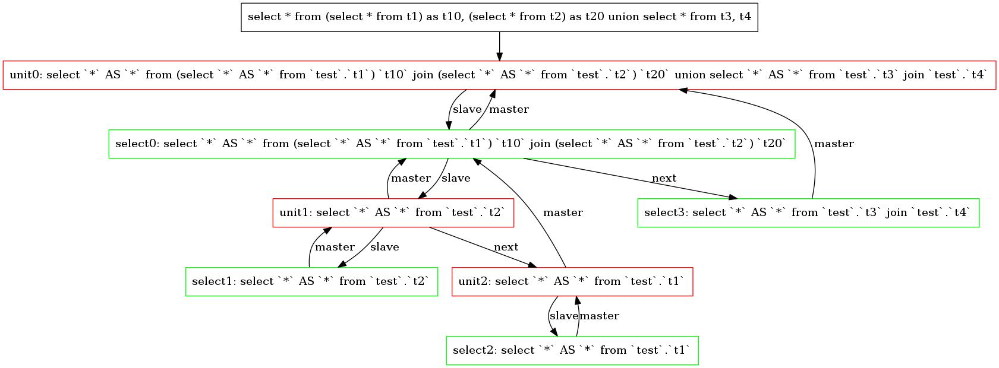
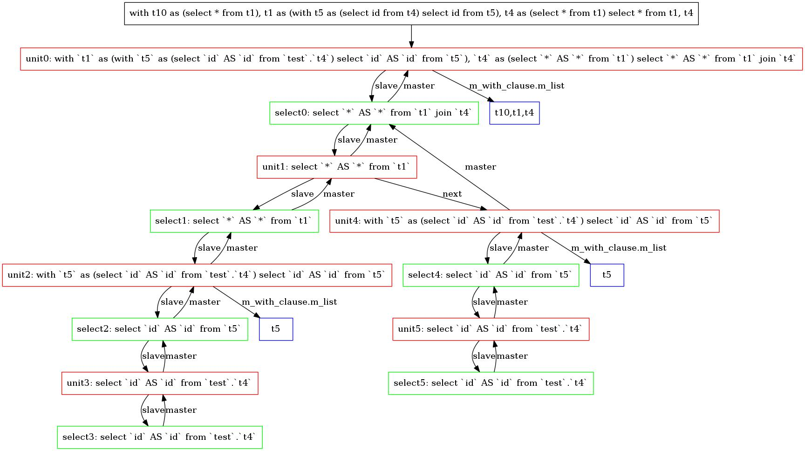

mysql8.0 cte语句的语法树构造
====

mysql8.0中生成parse tree节点和初始化parse tree节点被分成了两部分，通过MYSQLparse生成parse tree，每个节点由一个class构成，然后调用顶层的contextualize函数逐层初始化各个树节点。关于这部分的更详细内容建议先阅读[MySQL 8.0对Parser所做的改进][1]

mysql8.0中的语法解析会将带有子查询以及union等操作的复杂查询分解成更小的执行单元并用下述的两种结构进行关联

```c++
class SELECT_LEX: public Sql_alloc
{
  SELECT_LEX *next;
  /// The query expression containing this query block.
  SELECT_LEX_UNIT *master;
  /// The first query expression contained within this query block.
  SELECT_LEX_UNIT *slave;
  ...
};

class SELECT_LEX_UNIT: public Sql_alloc
{
  SELECT_LEX_UNIT *next;
  SELECT_LEX *master;
  /// The first query block in this query expression.
  SELECT_LEX *slave;
};
```

我们可以通过下面的例子更形象的观察一下一条普通sql的大致分解情况



代码中生成该结构的关键函数如下：

SELECT_LEX *LEX::new_query(SELECT_LEX *curr_select)创建unit，select，并将unit连接为传入的curr_select的slave以及两个子查询unit之间的关联（例：unit1，unit2）

```c++
  SELECT_LEX *const select= new_empty_query_block();
  if (!select)
    DBUG_RETURN(NULL);       /* purecov: inspected */
    
  enum_parsing_context parsing_place=
    curr_select ? curr_select->parsing_place : CTX_NONE;
  SELECT_LEX_UNIT *const sel_unit=
    new (thd->mem_root) SELECT_LEX_UNIT(parsing_place);
  if (!sel_unit)
    DBUG_RETURN(NULL);       /* purecov: inspected */
  sel_unit->thd= thd;
  // Link the new "unit" below the current select_lex, if any
  if (curr_select != NULL)
    sel_unit->include_down(this, curr_select);  //这里也会将两个子查询的unit关联起来
  select->include_down(this, sel_unit);
  select->include_in_global(&all_selects_list);
```


LEX::new_top_level_query生成初始的thd->lex->unit, thd->lex->select_lex

```c++
bool LEX::new_top_level_query()
{
  ...
  select_lex= new_query(NULL);
  if (select_lex == NULL)
    DBUG_RETURN(true);     /* purecov: inspected */
  unit= select_lex->master_unit();
  ...
}
```


PT_subquery::contextualize生成子查询的unit，select并与上层的select连接

```c++
    // Create a SELECT_LEX_UNIT and SELECT_LEX for the subquery's query
    // expression.
    SELECT_LEX *child= lex->new_query(pc->select);
    if (child == NULL)
      return true;
    Parse_context inner_pc(pc->thd, child);
    if (m_is_derived_table)
      child->linkage= DERIVED_TABLE_TYPE;
    if (qe->contextualize(&inner_pc))
      return true;
    select_lex= inner_pc.select->master_unit()->first_select();
    lex->pop_context();

```

通过SELECT_LEX *LEX::new_union_query生成union两侧的SELECT_LEX的关联（例：select0，select3）

```c++
  SELECT_LEX *const select= new_empty_query_block();
  if (!select)
    DBUG_RETURN(NULL);       /* purecov: inspected */

  select->include_neighbour(this, curr_select);
```

通过下面的例子我们来观察一下cte语法树生成的过程

with t10 as (select * from t1), t1 as (with t5 as (select id from t4) select id from t5), t4 as (select * from t1) select * from t1, t4;



[1]. 通过MYSQLparse生成parse tree，此时后面contextualize阶段将属于unit0的m_with_clause.m_list中已经获取到t10，t1，t4，此时unit0->slave还没有生成

```c++
with_list:   
          with_list ',' common_table_expr                        
          {                 
            if ($1->push_back($3))
              MYSQL_YYABORT;               
          }                   
        | common_table_expr                    
          {        
            $$= NEW_PTN PT_with_list(YYTHD->mem_root);
            if ($$ == NULL || $$->push_back($1))              
              MYSQL_YYABORT;    /* purecov: inspected */                    
          }   
```

[2]. 通过各个节点的contextualize初始化AST，在PT_with_claust::contextualize阶段unit0会与相应的m_with_clause建立关联，初始化select0阶段在SELECT_LEX::add_table_to_list中对t1进行操作时需要确认t1是否是cte表从而转入3

[3]. 在SELECT_LEX::find_common_table_expr中将会进行从unit0->m_with_clause的PT_with_clause::lookup函数查找它t1是否属于该m_with_clause.m_list从而确认t1是cte表

```c++
bool
SELECT_LEX::find_common_table_expr(THD *thd, Table_ident *table_name,
                                   TABLE_LIST *tl, Parse_context *pc,
                                   bool *found)
{ 
  *found= false;
  ...
  do
  { 
    DBUG_ASSERT(select->first_execution);
    unit= select->master_unit();
    if (!(wc= unit->m_with_clause))
      continue;
    if (wc->lookup(tl, &cte))
      return true;
  } while (cte == nullptr && (select= unit->outer_select()));

  if (cte == nullptr)
    return false;
  *found= true;
...
} 
```

[4]. 通过t1的make_subquery_node对(with t5 as (select id from t4) select id from t5)生成子查询节点发现select4在MYSQLparse阶段已经生成，只是还未初始化

[5]. wc->enter_parsing_definition(tl)将tl（t1）保存在unit0->m_with_clause->m_most_inner_in_parsing

[6]. 通过PT_subquery::contextualize初始化select4，在select4的find_common_table_expr中通过unit4->m_with_clause->lookup()确认t5是cte表

[7]. wc->enter_parsing_definition(tl)将tl（t5）保存在unit4->m_with_clause->m_most_inner_in_parsing

[8]. 通过PT_subquery::contextualize初始化select5, select5的find_common_table_expr查找t4时会依次遍历unit5，unit4，unit0的m_with_clause.m_list，在unit0中遍历到t1时发现t1（is）unit0->m_with_clause->m_most_inner_in_parsing而且没有递归条件，将会查找失败，不会在继续遍历t4，select5的t4也就不会被当作cte表

```c++
bool PT_with_clause::lookup(TABLE_LIST *tl, PT_common_table_expr **found)
{
  *found= nullptr;
  DBUG_ASSERT(tl->select_lex != nullptr);
  /*
    If right_bound!=NULL, it means we are currently parsing the
    definition of CTE 'right_bound' and this definition contains
    'tl'.
  */
  const Common_table_expr *right_bound= m_most_inner_in_parsing ?
    m_most_inner_in_parsing->common_table_expr() : nullptr;
  bool in_self= false;
  for (auto el : m_list.elements())
  {  
    // Search for a CTE named like 'tl', in this list, from left to right.
    if (el->is(right_bound))
    {       
      /*   
        We meet right_bound.
        If not RECURSIVE:
        we must stop the search in this WITH clause;
        indeed right_bound must not reference itself or any CTE defined after it
        in the WITH list (forward references are forbidden, preventing any
        cycle).
        If RECURSIVE:
        If right_bound matches 'tl', it is a recursive reference.
      */
      if (!m_recursive)
        break;                                // Prevent forward reference.
      in_self= true;                          // Accept a recursive reference.
    }       
    bool match;
    if (el->match_table_ref(tl, in_self, &match))
      return true;
    if (!match)
    {       
      if (in_self)
        break;                                  // Prevent forward reference.
      continue;
    }  
    if (in_self && tl->select_lex->outer_select() != 
        m_most_inner_in_parsing->select_lex)
    {  
      my_error(ER_CTE_RECURSIVE_REQUIRES_SINGLE_REFERENCE,
               MYF(0), el->name().str);
      return true;
    }
    *found= el;
    break;
  }
  return false;
}
```

[9]. 处理完select0阶段的t1后再次按照2，3中同样的操作处理t4，在t4的make_subquery_node对t4 as (select * from t1) 生成子查询节点时发现cte表t1已经被select0引用了，需要重新调用MYSQLparse单独对t4 as (select * from t1)生成新的子查询节点，后面同5-8的处理逻辑大体相同
   **（对9不太理解的是为什么没有在PT_with_clause::contextualize内部就完成对select1的初始化反而要在select0的find_common_table_expr阶段生成并初始化这个节点，基于同样的原因对于6中的PT_subquery::contextualize为什么没有在PT_with_clause::contextualize内完成也有同样的疑问，特别是9将原本解耦的parse tree和初始化AST又重新耦合到了一起。。。可以注意到mysql的做法使得在select0中没有使用的with t10 as (select * from t1)是没有在任何子节点中生成的，而在PT_with_clause::contextualize完成全部工作会初始化无意义的t10，难道mysql只是为了避免这个问题吗？）**


**另一个值得一提的一点是cte表多次引用只会生成一个临时表，而子查询会生成多个**

```sql
mysql> explain format=json WITH cte as (select id,count(id) from t3 group by id) SELECT * FROM  cte, cte as ct;
 {
  "query_block": {
    "select_id": 1,
    "cost_info": {
      "query_cost": "5.65"
    },
    "nested_loop": [
      {
        "table": {
          "table_name": "cte",
          "access_type": "ALL",
          "rows_examined_per_scan": 2,
          "rows_produced_per_join": 2,
          "filtered": "100.00",
          "cost_info": {
            "read_cost": "2.52",
            "eval_cost": "0.20",
            "prefix_cost": "2.73",
            "data_read_per_join": "48"
          },
          "used_columns": [
            "id",
            "count(id)"
          ],
          "materialized_from_subquery": {
            "using_temporary_table": true,
            "dependent": false,
            "cacheable": true,
            "query_block": {
              "select_id": 2,
              "cost_info": {
                "query_cost": "0.45"
              },
              "grouping_operation": {
                "using_temporary_table": true,
                "using_filesort": false,
                "table": {
                  "table_name": "t3",
                  "access_type": "ALL",
                  "rows_examined_per_scan": 2,
                  "rows_produced_per_join": 2,
                  "filtered": "100.00",
                  "cost_info": {
                    "read_cost": "0.25",
                    "eval_cost": "0.20",
                    "prefix_cost": "0.45",
                    "data_read_per_join": "16"
                  },
                  "used_columns": [
                    "id"
                  ]
                }
              }
            }
          }
        }
      },
      {
        "table": {
          "table_name": "ct",
          "access_type": "ALL",
          "rows_examined_per_scan": 2,
          "rows_produced_per_join": 4,
          "filtered": "100.00",
          "using_join_buffer": "Block Nested Loop",
          "cost_info": {
            "read_cost": "2.53",
            "eval_cost": "0.40",
            "prefix_cost": "5.65",
            "data_read_per_join": "96"
          },
          "used_columns": [
            "id",
            "count(id)"
          ],
          "materialized_from_subquery": {
            "sharing_temporary_table_with": {
              "select_id": 2
            }
          }
        }
      }
    ]
  }
}
mysql> show warnings;
| Note  | 1003 | with `cte` as (/* select#2 */ select `test`.`t3`.`id` AS `id`,count(`test`.`t3`.`id`) AS `count(id)` from `test`.`t3` group by `test`.`t3`.`id`) /* select#1 */ select `cte`.`id` AS `id`,`cte`.`count(id)` AS `count(id)`,`ct`.`id` AS `id`,`ct`.`count(id)` AS `count(id)` from `cte` join `cte` `ct` |

mysql> explain format=json select * from (select id,count(id) from t3 group by id) as t11, (select id, count(id) from t3 group by id) as t12;
   {
  "query_block": {
    "select_id": 1,
    "cost_info": {
      "query_cost": "5.65"
    },
    "nested_loop": [
      {
        "table": {
          "table_name": "t11",
          "access_type": "ALL",
          "rows_examined_per_scan": 2,
          "rows_produced_per_join": 2,
          "filtered": "100.00",
          "cost_info": {
            "read_cost": "2.52",
            "eval_cost": "0.20",
            "prefix_cost": "2.73",
            "data_read_per_join": "48"
          },
          "used_columns": [
            "id",
            "count(id)"
          ],
          "materialized_from_subquery": {
            "using_temporary_table": true,
            "dependent": false,
            "cacheable": true,
            "query_block": {
              "select_id": 2,
              "cost_info": {
                "query_cost": "0.45"
              },
              "grouping_operation": {
                "using_temporary_table": true,
                "using_filesort": false,
                "table": {
                  "table_name": "t3",
                  "access_type": "ALL",
                  "rows_examined_per_scan": 2,
                  "rows_produced_per_join": 2,
                  "filtered": "100.00",
                  "cost_info": {
                    "read_cost": "0.25",
                    "eval_cost": "0.20",
                    "prefix_cost": "0.45",
                    "data_read_per_join": "16"
                  },
                  "used_columns": [
                    "id"
                  ]
                }
              }
            }
          }
        }
      },
      {
        "table": {
          "table_name": "t12",
          "access_type": "ALL",
          "rows_examined_per_scan": 2,
          "rows_produced_per_join": 4,
          "filtered": "100.00",
          "using_join_buffer": "Block Nested Loop",
          "cost_info": {
            "read_cost": "2.53",
            "eval_cost": "0.40",
            "prefix_cost": "5.65",
            "data_read_per_join": "96"
          },
          "used_columns": [
            "id",
            "count(id)"
          ],
          "materialized_from_subquery": {
            "using_temporary_table": true,
            "dependent": false,
            "cacheable": true,
            "query_block": {
              "select_id": 3,
              "cost_info": {
                "query_cost": "0.45"
              },
              "grouping_operation": {
                "using_temporary_table": true,
                "using_filesort": false,
                "table": {
                  "table_name": "t3",
                  "access_type": "ALL",
                  "rows_examined_per_scan": 2,
                  "rows_produced_per_join": 2,
                  "filtered": "100.00",
                  "cost_info": {
                    "read_cost": "0.25",
                    "eval_cost": "0.20",
                    "prefix_cost": "0.45",
                    "data_read_per_join": "16"
                  },
                  "used_columns": [
                    "id"
                  ]
                }
              }
            }
          }
        }
      }
    ]
  }
} 
1 row in set, 1 warning (3.19 sec)
mysql> show warnings;

| Note  | 1003 | /* select#1 */ select `t11`.`id` AS `id`,`t11`.`count(id)` AS `count(id)`,`t12`.`id` AS `id`,`t12`.`count(id)` AS `count(id)` from (/* select#2 */ select `test`.`t3`.`id` AS `id`,count(`test`.`t3`.`id`) AS `count(id)` from `test`.`t3` group by `test`.`t3`.`id`) `t11` join (/* select#3 */ select `test`.`t3`.`id` AS `id`,count(`test`.`t3`.`id`) AS `count(id)` from `test`.`t3` group by `test`.`t3`.`id`) `t12` |
```

两个语句执行结果一致，但从查询计划可以看出cte语句中第二次尝试打开表时会和select_id：2共享通过t3生成的临时表，而子查询则会生成两个相同的临时表

参考链接：

[1]. [MySQL 8.0对Parser所做的改进][1]

[2]. [CTE执行过程与实现原理][2]

[1]: http://mysql.taobao.org/monthly/2017/04/02/	"MySQL 8.0对Parser所做的改进"
[2]: https://yq.aliyun.com/articles/71981?spm=5176.100239.blogcont96418.17.CxWw4v	"CTE执行过程与实现原理"
